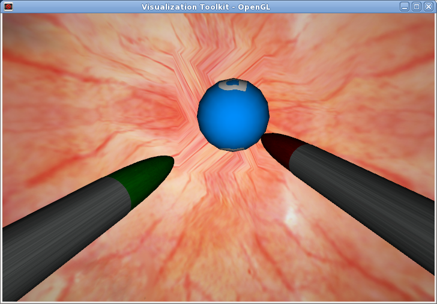
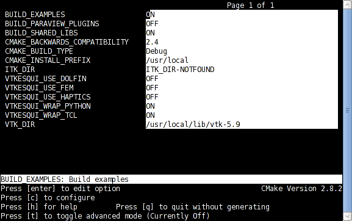
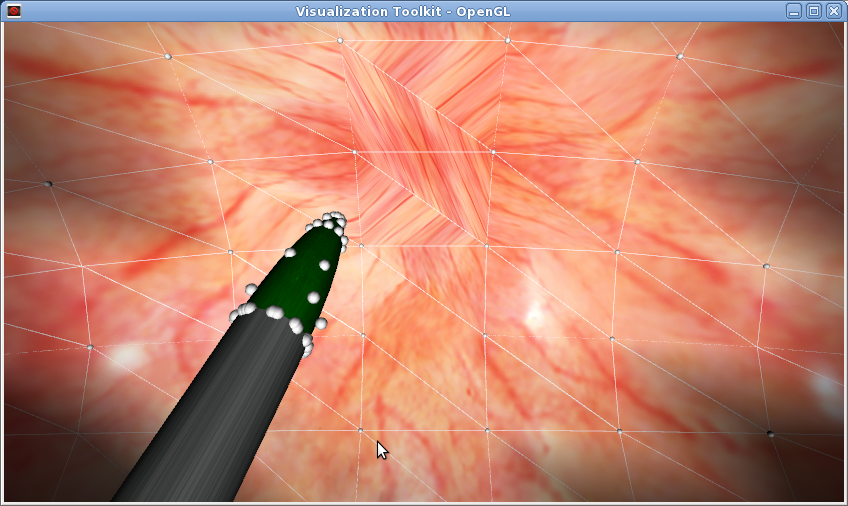
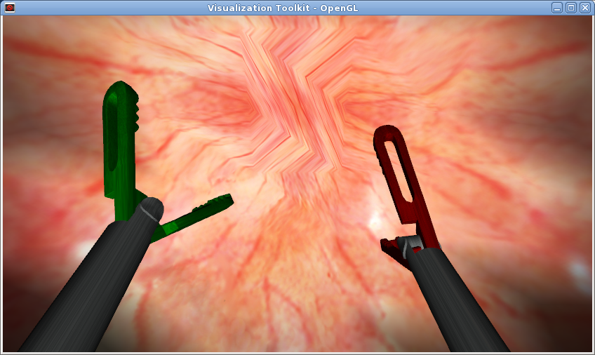
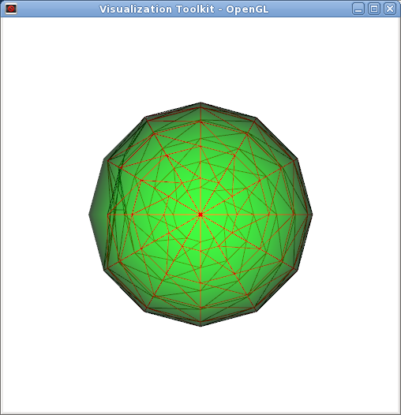
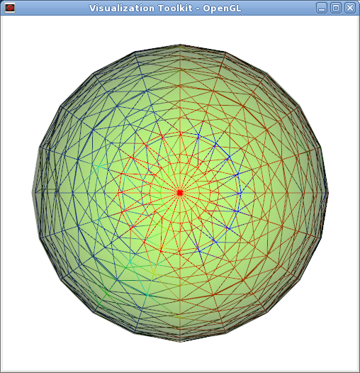

==========================
vtkESQui Developer's Guide
==========================

:Author:   Jorge Ballesteros-Ruiz <jballesteros@itccanarias.org>
:Version:  0.5.3
:Web:      http://motivando.me
:Date:     Aug 30th 2011

.. header:: 
     
   ###Title###

.. footer::

   .. oddeven::

      .. class:: headertable

      +---+---+----------------+
      |   |   |.. class:: right|
      |   |   |                |
      |   |   | ###Page###     |
      +---+---+----------------+

      .. class:: headertable

      +------------+---+---+
      |            |   |   |
      |            |   |   |
      | ###Page### |   |   |
      +------------+---+---+

.. raw:: pdf

   PageBreak coverPage

.. contents:: :depth: 3

.. raw:: pdf

   PageBreak oneColumn

.. section-numbering::

Introduction
============

The aim of this document is to describe the *vtkESQui* project, in a detailed manner. This documentation is focused to developers who want to experiment with this platform. 

Background
----------

*vtkESQui* is a surgical simulation software platform. The purpose of this project to provide a framework which allows, in an easy way, to build a virtual simulation of minimallly invasive surgical techniques.

This platform, is a vtk-based software project that has been implemented in C++. *vtkESQui* framework follows the standard folder structure for a vtk-based projects. A few access layers (wrappers) has been enabled to ease the use of the platform, such as: Tcl and Python. 

 .. class:: figuretable 

 +-----------------------------+-------------------------------+
 | .. class:: centered         | .. class:: centered           |
 |                             |                               |
 | .. figure:: figures/vtk.jpg | .. figure:: figures/cmake.png |
 |    :height: 400px           |    :height: 400px             |
 +-----------------------------+-------------------------------+

Compilation of the platform is done with *CMake*, what makes it a cross-platform project. It has been compiled and fully tested in Windows and Unix systems.

The goal is to provide the user a simple way to build a surgical scenario and easily interact with it. In a few words, a scenario (organs, tools, etc...) is generated and a simulation process is executed to manage the interaction between these scenario objects.

   vtkESQui surgical scenario simulation

In vtkESQui platform, there are two ways of controlling the simulation objects, let's say simulation interactors:

 * Keyboard + Mouse: Depending on the type of simulation, a mouse movement combined with a keyboard layout is used to control the simulation instruments (tools).
 * Haptic Devices: In case a haptic device is available, it can be used to handle the simulation instruments. Interfaces has been implemented for the following haptic devices:

  ===============  ===============================================
  *Xitact VSP*     Endovascular techniques
  *Xitact IHP*     Laparoscopic & Arthroscopic techniques
  *Immersion LSW*  Laparoscopic technique: Laparoscopic techniques
  ===============  ===============================================

  .. note:: Haptic technology is a tactile feedback technology that estimulate the user sense of touch by applying forces and vibrations to the control device. It has been proved that haptic devices are extremely useful for training minimally invasive procedures, improving instrument control and making more realistic simulations. 

Import of surgical scenarios into the *vtkESQui* framework is done from an SRML file, that contains all the information required to define a surgical simulation:

 * Simulation: Simulation parameters such as: type, time rates, etc...  
 * Environment
  
  * Camera: position, orientation...
  * Lights: intensity, color...
 
 * Objects: scenario objects such as: organs, tools, etc...
   
  * Elements
    
   * Models: visualization, collision and deformation models

Software License
----------------

.. include:: 
   ../../LICENSE.TXT
   :literal:
   :start-line: 7
   :end-line: 60

Installation
============

This section covers the whole process to obtain your own copy of *vtkESQui* properly installed and fully working in your computer.

Requirements
------------

In order to use this software the following packages must be installed:

* *VTK*. version > 5.6. http://www.vtk.org
* *Tcl/Tk*. version > 8.4. http://www.tcl.tk
* *CMake*. version > 2.5. http://www.cmake.org

This software has been compiled and tested in:

* Windows: (Visual Studio 2005 and Visual Studio 2008)
* Unix: (gcc > 4.4).

Download
--------

There are multiple ways to get the software:

* Download the latest release at http://motivando.me/vtkESQui.html
* Insight Journal
* Access the git source-code repository::
 
  $ git clone git://aecio/vtkESQui.git

* Github::

  $ git clone git://github.com/Motiva/vtkESQui.git

Configuring
-----------

As a vtk-based project, *vtkESQui* configuration and compilation is done using *CMake* (http://cmake.org). *CMake* is a cross-platform, open-source build system that automatically generates makefiles and workspaces for later compilation.

1. Once the source code has been downloaded and extracted/saved into a directory, let's name it VTKESQUI_SRC_DIR, a new binary directory has to be created.

 In Unix-like systems:: 

  $ mkdir vtkESQuiBin
  $ cd vtkESQuiBin
  $ ccmake $VTKESQUI_SRC_DIR

 In Windows, the CMake GUI is used to define source and binary dir.

2. Follow the *ccmake* configuration. Don't forget to set the VTK_DIR path (the folder where you have compiled vtk and you have your VTKConfig.cmake file), and the Tcl/Tk libraries path. If you would like to use the software with haptic devices (LWS-Immersion Corp, IHP,etc), please set the *CMake* variable VTKESQUI_USE_HAPTICS to ON. The wrapping and other configuration are done by default (they are included in the CMakelist.txt file).

   CMake configuration options

3. Enable/Disable Wrapping

*vtkESQui* wrapping of the code will require to build the project as shared libraries. To do so set the varaible BUILD_SHARED_LIBS to ON in the configuring_ process.

 * TCL access to the code is enabled in the project configuring_ process, by setting the VTKESQUI_USE_TCL variable to ON.
 * If you want to enable Python wrapping, please configure the project enabling the VTKESQUI_USE_PYTHON variable.

4. Enable/Disable Testing and Examples:

 BUILD_EXAMPLES 

5. Finally, after configuring the *CMake* options

 * In Unix-like systems: Press 'c' to configurate project and then 'g' to generate the makefiles
 * In Windows: Press Configure button and then Generate button.

Building
--------

Once you have succesfully configured the project, the building process is started by:

 In Unix::

  $ make
 
 If anything went wrong, you may have *vtkESQui* platform compiled. If you want to install *vtkESQui* in your operating system you must login as root and then type::

  $ make install

 If you are a Windows user, import the project in Visual Studio, and compile it as usual. Installation of the project is done by executing INSTALL project configuration in Visual Studio.

Setting up the environment
--------------------------

In order to get the platform fully operative, you may need to configurate the working environment. Make sure all the requirements_ are fullfiled and the packages are properly configured.

Set the environment variables: LD_LIBRARY_PATH, PYTHONPATH and TCLLIBPATH to the path where are the (.so/dlls) vtk/wrapping libraries. If you have other Tcl/Tk versions, you should declare the TK_LIBRARY and TCL_LIBRARY variables.

i.e. (under linux)::

 LD_LIBRARY_PATH=$LD_LIBRARY_PATH:/usr/local/lib/vtk-5.9:/home/user/software/bin/vtkESQui/bin/
 export LD_LIBRARY_PATH

You also may hav to add the library path to the PATH environment variable::

 PATH=$PATH:/home/user/software/bin/vtkESQui/bin/
 export PATH

TCL/Python Wrapping
...................

In order to use TCL wrappers, you may have to add the following path to the TCLLIBPATH variable::

 TCLLIBPATH="$TCLLIBPATH /home/user/software/src/vtkESQui/Wrapping/Tcl"
 export TCLLIBPATH

Note: values are separated by spaces.

For Python wrapping, add the following paths to th PYTHONPATH variable::

 PYTHONPATH=$PYTHONPATH:/home/user/software/bin/vtkESQui/bin
 PYTHONPATH=$PYTHONPATH:/home/user/software/src/vtkESQui/Wrapping/Python
 export PYTHONPATH

Design
======

This section contains a detailed description of the *vtkEQSui* framework design layout: Folder structure, Framework architecture, etc...

Structure
---------

As a vtk-based project, *vtkESQui* follows the *VTK* folder structure. The framework has been implemented in a modular way, trying to make, if possible, every module independent from the rest. In this release the following folders are included:

===================  =================================================
Module               Description
===================  =================================================
BioMechanics         Biomechanical (deformation) models and interfaces
CollisionDetection   Collision detection models and interfaces
Common               Project wide needed by the project
Documentation        Documentation of the platform: Doxygen, user & developer guides
Examples             List of examples implemented in C++, Python and Tcl
Haptics              Classes that wrap the haptic device's API
Scenario             Management of the rendered objects
Simulation           Simulation process execution
Utilities            Scripts and C++ classes to share/export/import models
Wrapping             Wrapping under Python and Tcl
===================  =================================================

Each module of the platform is stored in one folder, containing all the *C++* classes and testing scripts.

Framework
---------

The following diagram shows in a glimpse the architecture of the platform:

.. image:: ../Doxygen/html/classvtkSimulation__coll__graph.png
   :scale: 200%
   :align: center

*vtkSimulation* class executes a cyclic process at time rate previously defined. The whole simulation is updated on every step and the render window is refreshed to display any change the scenario objects could have suffered.

In a standard simulation process there are three main modules involved:

 * Collision: Handle collision between scenario object models
 * Rendering: Refresh object display properties
 * Interaction: User-machine interface for simulation object control

Attending to the *vtkESQui* architecture, the following section contains all the project modules classes description.

Modules
=======

In this section we explain the usage and the functionalities of the modules developed using the *vtkESQui* framework. 

Common
------

The Common module contains all the core classes that serve as base class for the rest of the project classes.

vtkModel
........

This class represents an abstract model on a scenario element. It acts as a base class for visualization, collision and deformation models. 

.. image:: ../Doxygen/html/classvtkModel__inherit__graph.png
   :scale: 200%
   :align: center

vtkModel class has 2 inputs:

== ================== ============================ ========
Id Object type        Description                  R/O
== ================== ============================ ========
0  vtkPolyData object Defines input mesh           Required
1  vtkPolyData object Defines synchronization mesh Optional
== ================== ============================ ========

By default, main input data will be set as a vtkPolyData object. Optionally it could be read from a vtp file, specifying the *FileName* attribute. The optional input, source, will be specified as vtkPolyData object.

Prior to an update, an initialization of the object, through Init() function, is required, if the model is not included in a vtkScenarioElement_. In case the models is part of a vtkScenarioElement_ object, the element itself will initialize the model.

After an update the object output will contain the synchronized mesh, if source mesh has been set.

Every model has its own transform function with its own transform matrix. This matrix could be replaced by setting it before model initialization. According to transformation matrix values, the model actor will be updated. The transformed mesh will be available by retrieving the model actor.

This class is inherited by vtkVisualizationModel_, vtkCollisionModel_ and vtkDeformationModel_.

vtkModelCollection
..................

vtkModelCollection is an object for creating and manipulating lists of vtkModel_ items. The lists are unsorted and allow duplicate entries.

Scenario
--------

The scenario module contains all classes that manage the scenario objects display. A revision to all these classes, from bottom to top in its hierarchy level, is made in this section of the document.

vtkVisualizationModel
.....................
vtkVisualizationModel object defines a visualization mesh, in other words a vtkPolyData object.

This class inherits from vtkModel_ base class. As it is specified in vtkModel_, at least an input mesh should be defined. Optionally a source mesh for synchronization purposes may be defined.

.. image:: ../Doxygen/html/classvtkVisualizationModel__inherit__graph.png
   :scale: 200%
   :align: center

Additionally, in order to enhance visualization user experience, a mesh texture can be specified through the *TextureFileName* attribute. This file path specified must contain a square .jpg file.

Note: In this case, the optional vtkModel_ object input is ignored because no synchronization will be performed.

vtkScenarioElement
..................

vtkScenarioElement class implements the use of a surgical scenario element.

This class contains all the required attributes to define a scenario element, providing an easy use of element models collections.

.. image:: ../Doxygen/html/classvtkScenarioElement__coll__graph.png
   :scale: 200%
   :align: center

At least a visualization model has to be defined in the scenario element. To enable collision detection a vtkCollisionModel_ must be set to the element. If the element is deformable, a vtkDeformationModel_ must also be defined.

Positional parameters, such as Position, Orientation, Scale, etc... must be set in this object. All the element models will be located and transformed according to the specified values.

Prior to un update of the class, the initialization method, Init(),  should be executed. This method will initialize the element and subsequently all of its models. If a scenario model has been previously initialized it will not be synchronized with the rest of the object models.

Please refer to the Doxygen documentation and the Examples_ section if you want to know more about this class.

vtkScenarioElementCollection
............................

vtkScenarioElementCollection is an object for creating and manipulating lists of vtkScenarioElement_ items. The lists are unsorted and allow duplicate entries.

vtkScenarioObject
.................

vtkScenarioObject class implements the use of a surgical scenario object.

This class contains all the required attributes to define a scenario object, providing an easy use of surgical objects such as: tools, organs, etc...

The following graph shows the inheritance hierarchy of this class:

.. image:: ../Doxygen/html/classvtkScenarioObject__inherit__graph.png
   :scale: 200%
   :align: center

Every scenario object, vtkScenarioObject_ is formed a collection of scenario elements, vtkScenarioElement_ *Elements*. At least one scenario element per scenario object must be defined.

.. image:: ../Doxygen/html/classvtkScenarioObject__coll__graph.png
   :scale: 200%
   :align: center

In order to manage scenario objects interaction, a collection of collisions (see vtkCollisionCollection_), *Collisions*, has been included in this this class.

Please refer to Doxygen documentation and Examples_ section if you want to know more about this class.

vtkScenarioObjectCollection
...........................

vtkScenarioObjectCollection is an object for creating and manipulating lists of vtkScenarioObject_ items. The lists are unsorted and allow duplicate entries.

vtkOrgan
........

Implementation class for scenario organ definition.

In *vtkESQui* an organ is considered a scenario object, so vtkScenarioObject_ serves as its base class.

.. image:: ../Doxygen/html/classvtkOrgan__coll__graph.png
   :scale: 200%
   :align: center

Whether a deformation model of the vtkScenarioElement_ has been defined, the organ will behave as an static or deformable object.

Please refer to Examples_ section if you want to know more about this class.

vtkTool
.......

Implementation class for scenario tool definition.

In *vtkESQui* a tool is considered a scenario object, so vtkScenarioObject_ serves as its base class.

.. image:: ../Doxygen/html/classvtkTool__inherit__graph.png
   :scale: 200%
   :align: center

This class is inherited by specific surgical technique tool implementations: vtkToolLaparoscopy_, vtkToolEndovascular_, etc...

vtkToolEndovascular
...................

vtkToolEndovascular class implements a surgical endovascular tool.

This class inherits from vtkTool_, and serves as base class for specific endovascular techniques tools: vtkToolCatheter_, etc...

.. image:: ../Doxygen/html/classvtkToolEndovascular__inherit__graph.png
   :scale: 200%
   :align: center

A few specific movements (rotation, insertion, etc...) has been defined to handle the tool.

vtkToolCatheter
...............

Implementation class of an endovascular catheter tool.

.. image:: ../Doxygen/html/classvtkToolCatheter__inherit__graph.png
   :scale: 200%
   :align: center

This class inherits from vtkToolEndovascular_. Contains methods for position/orientation control of the tool in the scene and collision detection.

Please refer to Examples_ section if you want to know more about this class.

vtkToolLaparoscopy
..................

vtkToolLaparoscopy class implements a surgical laparoscopic tool.

This class inherits from vtkTool_, and serves as base class for specific laparoscopic techniques tools: vtkToolProbe_, vtkToolGrasper_, etc...

.. image:: ../Doxygen/html/classvtkToolLaparoscopy__inherit__graph.png
   :scale: 200%
   :align: center

A few laparoscopic specific movements (rotation, insertion, opening etc...) has been defined to control the tool.

vtkToolProbe
..............

Implementation class of a surgical laparoscopic probe.

This class, that inherits from vtkToolLaparoscopy_, defines a surgical laparoscopic probe, inside the scenario.

.. image:: ../Doxygen/html/classvtkToolProbe__inherit__graph.png
   :scale: 200%
   :align: center

A laparoscopic probe is composed of 2 elements:

 * *Stick*
 * *Tip*

Contains methods for position control of the tool in the scene and collision detection.

   vtkESQui simulation screenshot displaying a laparoscopic probe.

Note: The white dots represent the collision model and the white grid deformation model.

Please refer to Examples_ section if you want to know more about this class.

vtkToolGrasper
..............

Implementation class of a surgical laparoscopic grasper.

This class, that inherits from vtkToolLaparoscopy_, defines a surgical laparoscopic grasper, inside the scenario.

.. image:: ../Doxygen/html/classvtkToolGrasper__inherit__graph.png
   :scale: 200%
   :align: center

A laparoscopic probe is composed of 3 elements:

 * *Stick*
 * 2 *Levers*

Contains methods for position/orientation control of the tool in the scene and collision detection.

Please refer to Examples_ section if you want to know more about this class.

   vtkESQui simulation screenshot displaying two laparoscopic graspers.

Note: The white dots represent the collision model and the white grid deformation model.

vtkToolScissors
...............

Implementation class of surgical laparoscopic scissors.

This class, that inherits from vtkToolLaparoscopy_, defines surgical laparoscopic scissors, inside the scenario.

.. image:: ../Doxygen/html/classvtkToolScissors__inherit__graph.png
   :scale: 200%
   :align: center

Laparoscopic scissors are composed of 3 elements:

 * *Stick*
 * 2 *Blades*

Contains methods for position/orientation control of the tool in the scene and collision detection.

Please refer to Examples_ section if you want to know more about this class.

vtkScenario
...........

In *vtkESQui* framework a surgical scenario is implemented with this class.

All the elements in the scenario (organs, tools...) are stored in a collection, *Objects*. Any scenario object should be previously defined (all of its required parameters set) and initialized before being inserted/added to the scenario.

.. image:: ../Doxygen/html/classvtkScenario__coll__graph.png
   :scale: 200%
   :align: center

Apart from scenario objects, a *vtkRenderWindow* object must be assigned before object initialization for displaying purposes. The following code excerpt shows initialization process of the simulation scenario:

.. include:: 
   ../../Scenario/vtkScenario.cxx
   :literal:
   :start-line: 138
   :end-line: 171

Please refer to Examples_ section if you want to know more about this class.

BioMechanics
------------

The BioMechanics module is filled with all the classes involved in deformation process of scenario objects. Every deformable scenario element, must have a deformation model defined. vtkDeformationModel_ class is the base class for the interfaces to several deformation systems.

vtkDeformationModel
...................

vtkDeformationModel object defines a deformation model based on a mesh, *vtkPolyData*.

.. image:: ../Doxygen/html/classvtkDeformationModel__coll__graph.png
   :scale: 200%
   :align: center

This class inherits from vtkModel_ base class. As it is specified in vtkModel, at least an input mesh should be defined. Optionally a source mesh for synchronization purposes may be defined.

.. image:: ../Doxygen/html/classvtkDeformationModel__inherit__graph.png
   :scale: 200%
   :align: center

An interface based on this class must be implemented to access available deformation models: 
 * vtkParticleSystem: vtkPSSInterface_
 * vtkExplicitDeformableModel: vtkEDMInterface_

vtkBoundaryCondition
....................

This class contains the required information to define a boundary condition.

vtkBoundaryCondition acts as data container storing all the useful information of a boundary condition:

 * *Type*
 * *Value*
 * *Point Identifier*
 * *Point Position*

vtkBoundaryConditionCollection
..............................

vtkBoundaryConditionCollection is an object for creating and manipulating lists of boundary conditions (vtkBoundaryCondition_). The lists are unsorted and allow duplicate entries.

vtkPSSInterface
...............

Interface class for a particle-spring deformation system.

This class, based in vtkDeformationModel_ class, adapts the access to the external vtkCUDAParticleSystem package.

.. image:: ../Doxygen/html/classvtkPSSInterface__coll__graph.png
   :scale: 200%
   :align: center

Prior an update, the interface has to be initialized. Some parameters must be previously defined:

======================= ===========================================
Input                   vtkPolyData object
Source                  vtkPolyData object of the visualization mesh.
DistanceCoefficient     Maximum distance between points
DampingCoefficient (d)  oscillation coefficient
SpringCoefficient (K)   spring coefficient
Mass                    unit mass of each particle
DeltaT                  time step of deformation process
SolverType              motion equation solver type
======================= ===========================================

The main input should be a vtkPolyData object with the following topology:
 
 * All points must be stored in the Points array.
 * All cells must be defined as VTK_LINE cell type.
 * All connected points must be linked with VTK_LINE cells.

Once these parameters has been set, the initialization function will iterate through the input mesh cell array, creating a spring, vtkSpring, for every VTK_LINE cell. Every point of the mesh will be imported as vtkParticle object. For more information on this class check out its own documentation.

The following screenshot displays the input mesh in translucid green and the deformed output as a grid.

   vtkESQui screenshot displaying an particle-spring deformation process

Feel free to check Testing and Examples_ folder if you want to know more about this class.

vtkEDMInterface
...............

Interface class for a explicit deformation system. This deformatiom model uses a level set technique adapting the input mesh to a *vtkImageData* input. 

vtkEDMInterface class, based in vtkDeformationModel_ class, adapts the access to the external vtkExplicitDeformable package.

.. image:: ../Doxygen/html/classvtkPSSInterface__coll__graph.png
   :scale: 200%
   :align: center

The interface has to be initialized in order to be updated. Some parameters must be previously defined:

================== ===========================
Input              vtkPolyData object
NumberOfIterations Maximum number of iterations
WarpScaleFactor    Deformation scale factor
================== ===========================

The following screenshot displays the input mesh in translucid green and the deformed output as a grid.

   vtkESQui screenshot displaying an explicit deformation process

Please Testing source folder if you want to know more about this class.

CollisionDetection
------------------

In the collision detection package are stored all the classes involved in the collision detection process. This process is run over the scenario obejct collision models (vtkCollisionModel_) and the obtained results are saved as vtkCollision_ objects.

vtkCollisionModel
.................

vtkCollisionModel object defines a collision model based on a mesh, *vtkPolyData*.

This class inherits from vtkModel_ base class. As it is specified in vtkModel_, at least an input mesh should be defined. Optionally a source mesh for synchronization purposes may be defined.

.. image:: ../Doxygen/html/classvtkCollisionModel__coll__graph.png
   :scale: 200%
   :align: center

vtkCollision
............

This class contains the required information to define a collision.

vtkCollision acts as data container storing all the useful information of a scenario collision:

 * *Type*
 * *ObjectId*
 * *ElementId*
 * *Point Id*
 * *Point Position*
 * *Cell Id*
 * *Distance* between collided points
 * *Displacement* vector obtained from objects inertia

All the information is stored in pairs, one for each scenario object collided.

vtkCollisionCollection
......................

vtkCollisionCollection is an object for creating and manipulating lists of scenario object collisions (vtkCollision_). The lists are unsorted and allow duplicate entries.

vtkCollisionDetection
.....................

Generic base class for collision detection library interfaces

This class serves as a base class for the collision detection libraries. Scenario object collision models, vtkCollisionModel_ must be assigned before process execution. The result of the procedure is collection of collisions, vtkCollisionCollection_, between scenario objects.

.. image:: ../Doxygen/html/classvtkCollisionDetection__coll__graph.png
   :scale: 200%
   :align: center

vtkBioEngInterface_, an interface based on this class, has been implemented to access the available deformation model, vtkbioeng.

vtkBioEngInterface
..................

This interface enables the access to the vtkbioeng collision detection library. In a few words, the object collision models are translated to its defined position, and then evaluated to check if they intersect between each other.

For more info on this collision library refer to http://sourceforge.net/projects/vtkbioeng/

Haptics
-------

Haptic devices, or haptics, are a tactile feedback device that takes advantage of a user's sense of touch by applying forces, vibrations, and/or motions to the user. This package contains all the required class to integrate the use of haptic devices into the *vtkESQui* platform.

vtkHaptic
.........

Generic haptic class for haptic device interface implementation.

.. image:: ../Doxygen/html/classvtkHaptic__inherit__graph.png
   :scale: 200%
   :align: center

This generic class serves as base for haptic devices interfaces. The following interfaces has been implemented:

 * vtkIHP_: Xitact IHP. Laparoscopic and arthroscopic techniques.
 * vtkVSP_: Xitact VSP. Endovascular techniques.
 * vtkLSW_: Immersion LSW. Laparoscopic techniques.

vtkIHP
......

vtkIHP class wraps the access to the IHP haptic device. This interface enables the interaction with the Xitact IHP haptic device.

.. image:: ../Doxygen/html/classvtkIHP__inherit__graph.png
   :scale: 200%
   :align: center

In a cyclic process the haptic is synchronously checked for changes. Device physical attributes are saved and then sent to the simulation process.

An access method to device initialization has also been implemented.

vtkVSP
......

vtkVSP class wraps the access to the VSP haptic device. This interface enables the interaction with the Xitact VSP haptic device.

.. image:: ../Doxygen/html/classvtkVSP__inherit__graph.png
   :scale: 200%
   :align: center

In a cyclic process the haptic is synchronously checked for changes. Device physical attributes are saved and then sent to the simulation process.

An access method to device initialization has also been implemented.

vtkLSW
......

vtkLSW class wraps the access to the LSW haptic device. This interface enables the interaction with the Immersion LSW haptic device.

.. image:: ../Doxygen/html/classvtkLSW__inherit__graph.png
   :scale: 200%
   :align: center

In a cyclic process the haptic is synchronously checked for changes. Device physical attributes are saved and then sent to the simulation process.

Access method to device initialization has also been implemented.

vtkLSWTool
..........

Immersion LSW tool interface class. This interface has been implemented to access each of the Immersion haptic device tools independently.

The haptic device could not be used unless a SetData command is sent to it. Once the tool has been initialized it could be accessed from a vtkESQui simulation process. 

Simulation
----------

This module purpose is to manage the surgical simulation process, including the following classes:

=============================  ===============
Class                          Description
=============================  ===============
vtkSimulation_                 Simulation process management
vtkSimulationInteractorStyle_  Default keyboard & mouse interactor
=============================  ===============

vtkSimulation
.............

Implementation of the *vtkESQui* simulation process.

Simulation process is executed with timer callback function that handles three timed threaded loops at different rates:

 * **Scenario**: This module purpose is to display/update all the scenario objects. Acts as an observer, listening to any possible change that may affect any of the scenario objects.
 * **Collision**: A collision detection process that handles interaction between scenario object collision models. If any collision is detected, the scenario module is notified to apply changes to the objectes (deformation, displacements, etc..)
 * **Interaction**: User-machine interface module. A haptic device, if present, send its internal values to the simulation process and the scenario objects are updated according to these values. If no haptic devices is present, then an auxiliary control system (Keyboard+Mouse) is available.

The following code excerpt shows implementation of the simulation process:

.. include:: 
   ../../Simulation/vtkSimulation.cxx
   :literal:
   :start-line: 58
   :end-line: 87

Please refer to Examples_ section if you want to know more about this class.

vtkSimulationInteractorStyle
............................

Implementation of the simulation interactor style. Defines a standard keyboard layout for simulation control in laparoscopic techniques.

.. image:: ../Doxygen/html/classvtkSimulationInteractorStyle__coll__graph.png
   :scale: 200%
   :align: center

Mouse and keyboard events are handled and further actions, such as rotations or translations, implemented.

Please refer to Examples_ section if you want to know more about this class.

Utilities
---------

The utilities module has been designed to act as an I/O interface of the *vtkESQui* framework. A few tools has been implemented to import data into the application.

vtkSRMLImporter
...............

Import an SRML scenario file into vtkESQui framework.

The following parameters should be defined before import process:
 * *FileName*: SRML file name (with full path)
 * *DataPath*: Base path for SRML referenced data files.

The SRML file format is the standard *vtkESQui* input file. Basically, a SRML file is an XML file that contains all the information required for a simulation execution. A DTD has been defined to standarize the creation of these files:

.. include:: 
   ../../Utilities/srml.dtd
   :literal:
   :start-line: 0
   :end-line: 22

vtk2Blender
...........

Tex_vtkBlender.py has been designed to import models designed in Blender (http://www.blender3d.org), a 3D modelling, animation and rendering software, into any vtk-based project.

For further information read Tex_Blender.py.pdf.

Meshing
.......

In some cases, the vtkDeformationModel_ implementations require a custom input *vtkPolyData* objects. For example, vtkPSSInterface_ requires a *vtkPolyData* object with VTK_LINE cell types. To satisify these requirements a few scripts has been developed to generate this custom input data files.

**BuildClosestPointMesh.py**

This scripts generates a vtp file (*vtkPolyData*) that satisfies the vtkPSSInterface_ input data requirements, by generating a VTK_LINE cell mesh from VTK_TRIANGLE cell mesh. Every point is connected to its n closest points by VTK_LINE cell.

The script is invoked as shown::

 vtkpython BuildClosestPointsMesh.py $inputFile $numberOfPoints $outputFile.

The parameters should be set:

============== ================================================================
inputfile      vtp file containing a *vtkPolyData* object of VTK_TRIANGLE cells
numberOfPoints Number of closest points for every point.
outputFile     File path to output vtp file
============== ================================================================

**BuildRigidityMesh.py**

This scripts generates a vtp file (*vtkPolyData*) that satisfies the vtkPSSInterface_ input data requirements, by generating a VTK_LINE cell mesh from VTK_TRIANGLE cell mesh. Every cell point it will be connected to its n neighborhood point by a VTK_LINE cell. For example, for n=1, each point is connected to every point of the cells it belongs. The biggest the n, the rigidest the mesh will become. 

The script is invoked as shown::

 vtkpython BuildRigidityMesh.py $inputFile $rigidityFactor $outputFile

The parameters should be set:

============== ================================================================
inputfile      vtp file containing a *vtkPolyData* object of VTK_TRIANGLE cells
rigidityFactor Neighborhood size
outputFile     File path to output vtp file
============== ================================================================

Examples
========
